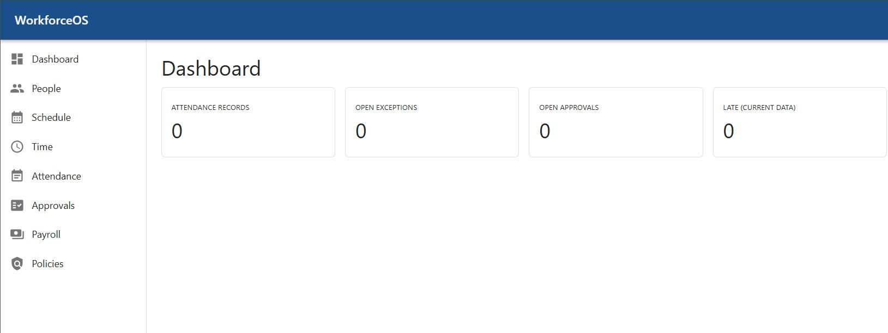
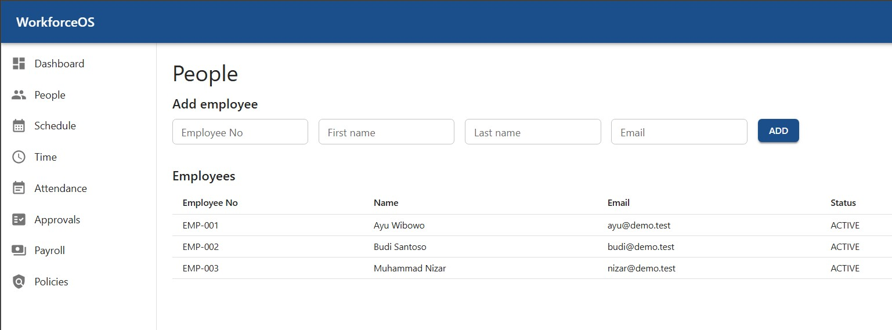
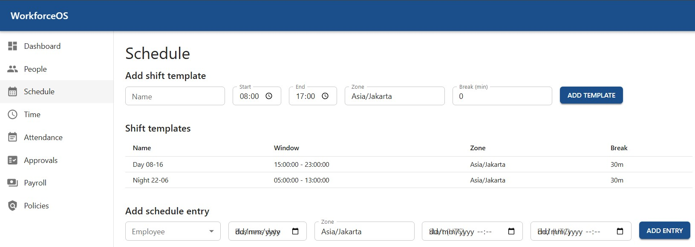
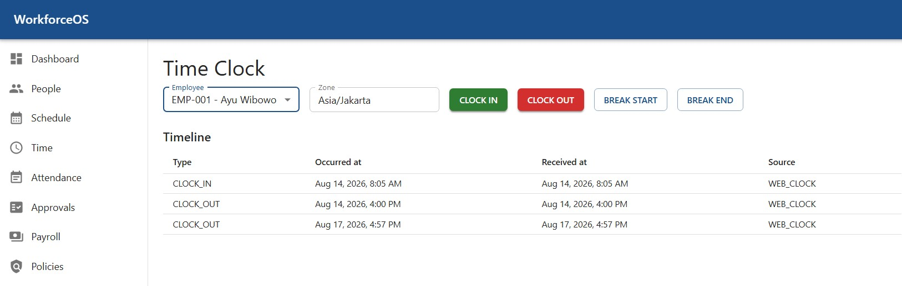

# WorkforceOS

**Enterprise Time, Attendance & Workforce Management Platform.**

A multi-tenant, time-zone-aware workforce management platform focused on the hardest
problems in time & attendance: scheduling, raw clock-event ingestion, attendance
calculation, configurable policies, exceptions, approvals, payroll readiness, auditability
and multinational operation.

Built as a **modular monolith** (Java 25 · Spring Boot 4.1 · Spring Modulith) with a
**React / TypeScript** single-page application frontend.

---

## Table of contents

1. [Features](#features)
2. [Screenshots](#screenshots)
3. [Architecture](#architecture)
4. [Tech stack](#tech-stack)
5. [Repository layout](#repository-layout)
6. [Prerequisites](#prerequisites)
7. [Local setup](#local-setup)
8. [Configuration](#configuration)
9. [Seed / master data](#seed--master-data)
10. [Demo walkthrough](#demo-walkthrough)
11. [Backend](#backend)
12. [Frontend](#frontend)
13. [Build & test](#build--test)
14. [Observability & security](#observability--security)
15. [Deployment](#deployment)
16. [Documentation](#documentation)
17. [Roadmap](#roadmap)
18. [License](#license)

---

## Features

- **Scheduling** — shift templates and per-employee schedule entries with overlap validation.
- **Time capture** — idempotent clock in/out/break events (retry-safe, dedup by idempotency
  key or source event id); immutable append-only timeline.
- **Attendance engine** — derives worked/regular/overtime/break minutes from raw events via
  composable rule strategies; correct across cross-midnight shifts and DST transitions.
- **Exceptions** — late, early-leave, absent, missing punch, overtime, unscheduled work,
  break violation — surfaced in a manager queue.
- **Approvals** — correction requests and manager approve/reject with optimistic locking and
  an immutable audit trail.
- **Payroll** — pay periods, readiness summary, close/reopen (audited), deterministic CSV
  export with checksum + version.
- **Multi-tenancy** — tenant isolation enforced at every layer; time-zone-aware end to end.

---

## Screenshots

| Dashboard | People |
|-----------|--------|
|  |  |

| Schedule | Time (clock) |
|----------|--------------|
|  |  |

---

## Architecture

### Backend — modular monolith

A single deployable Spring Boot application with explicit, independently testable **domain
modules** (Spring Modulith). The deployment boundary is intentionally larger than the
domain boundaries; module cycles are verified at build time.

```
com.workforceos.<module>/
├── domain/        aggregates, value objects, ports, domain services, events
├── application/   use-cases, transaction boundaries
├── adapter/       inbound (REST) and outbound (JPA / read-model) adapters
└── config/        Spring wiring
```

Modules: `tenancy`, `iam`, `people`, `organization`, `scheduling`, `timecapture`, `policy`,
`attendance`, `leave`, `approval`, `payroll`, `audit`, `notification`, `reporting`, plus a
`shared` kernel and a `web` infrastructure module.

Key engineering properties:

- **Time correctness** — events are `Instant` (UTC) + IANA `ZoneId` + business date; DST and
  cross-midnight shifts use instant arithmetic only.
- **Immutability** — raw time events are append-only; attendance records are derived and
  recalculable; published policy versions are effective-dated and immutable.
- **Idempotency** — clock events dedupe by idempotency key or source event id.
- **Concurrency** — approvals and payroll use optimistic locking (`@Version`).
- **Tenant isolation** — every tenant-owned query is scoped by `tenant_id` from the
  authenticated context; cross-tenant access returns "not found".

### Frontend — SPA

A Vite + React SPA with a clear separation of state:

- **Server state** → TanStack Query (caching, invalidation, retry).
- **Form state** → React Hook Form + Zod validation.
- **URL state** → React Router.
- **Local UI state** → component state.

The frontend calls the backend REST API (`/api/v1`) through a typed `apiFetch` client
(`src/shared/api/client.ts`); in dev it proxies `/api` to `:8080`.

---

## Tech stack

| Layer        | Backend                                        | Frontend                                   |
|--------------|------------------------------------------------|--------------------------------------------|
| Language     | Java 25 LTS                                    | TypeScript 6 (strict)                      |
| Framework    | Spring Boot 4.1, Spring Modulith 2.1           | React 19.2, Vite 8, Material UI 9          |
| Data         | Spring Data JPA, Flyway, PostgreSQL 17         | TanStack Query 5, React Hook Form + Zod    |
| Routing      | Spring MVC (REST)                              | React Router 7                             |
| Observability| Micrometer + Prometheus, OpenTelemetry tracing | —                                          |
| Build        | Maven (wrapper)                                | npm / Vite                                 |

---

## Repository layout

```
workforceos/
├── backend/                 Spring Boot modular monolith (com.workforceos.*)
│   ├── src/main/java/...    domain / application / adapter / config
│   ├── src/main/resources/db/migration/   Flyway schema + seed
│   ├── src/test/java/...    unit + Modulith + ArchUnit tests
│   └── Dockerfile
├── frontend/                React + TypeScript SPA (Vite)
│   ├── src/app/             providers, router, theme, query client
│   ├── src/features/        dashboard, people, schedule, time, attendance, approvals, payroll, policies
│   ├── src/shared/          api client, ui primitives, lib, test
│   └── Dockerfile, nginx.conf
├── docs/                    ADRs, security, testing, performance, deployment, screenshots
├── loadtest/                k6 load script
├── .github/workflows/       CI (build + security) and release (GHCR images)
└── compose.yaml             Optional Postgres + Redis (not needed with local Postgres)
```

---

## Prerequisites

- **JDK 25** — `JAVA_HOME` must point at it. Verify **both**:
  - `java -version` → `openjdk 25 ...`
  - `./mvnw.cmd --version` (backend dir) → `Java version: 25` (this is what Maven actually uses)
- **Node.js 22+** and npm.
- **PostgreSQL 17** running locally (see credentials below).
- Redis — *optional*; the demo runs without it.

> **Troubleshooting** — if you see `error: release version 25 not supported` while
> `java -version` reports 25, your `JAVA_HOME` points at an older JDK. Maven uses
> `JAVA_HOME`, not your `PATH`. Fix it once (then open a **new** terminal):
>
> ```powershell
> setx JAVA_HOME "C:\Program Files\Java\jdk-25"
> ```
>
> Verify with `./mvnw.cmd --version` (should print `Java version: 25`).

---

## Local setup

Assumes a local PostgreSQL at `localhost:5432` with user `postgres`, password `root`
(override via environment variables — see [Configuration](#configuration)).

### 1. Create the database (one time)

```bash
psql -h localhost -p 5432 -U postgres -c "CREATE DATABASE workforceos;"
```

Or create it in pgAdmin. Tables and seed data are created automatically by Flyway on first
startup — no manual SQL needed.

### 2. Run the backend

```bash
cd backend
# Windows
mvnw.cmd spring-boot:run
# macOS / Linux
./mvnw spring-boot:run
```

Starts on **http://localhost:8080**. Watch for `Started WorkforceOsApplication`.

### 3. Run the frontend

```bash
cd frontend
npm install
npm run dev
```

Open **http://localhost:5173** (proxies `/api` → `:8080`).

---

## Configuration

### Backend (`backend/src/main/resources/application.yml`)

| Property | Default | Env var |
|----------|---------|---------|
| Database URL | `jdbc:postgresql://localhost:5432/workforceos` | `DB_URL` |
| Username | `postgres` | `DB_USERNAME` |
| Password | `root` | `DB_PASSWORD` |
| Server port | `8080` | `SERVER_PORT` |
| Profile | `local` | `SPRING_PROFILES_ACTIVE` |
| CORS origins | `http://localhost:5173` | `CORS_ALLOWED_ORIGINS` |

### Frontend

`VITE_API_BASE_URL` (see `frontend/.env.example`) — empty in dev (uses the Vite proxy);
set it to the backend's absolute API root for a separate production deployment.

**Dev-mode identity:** the backend uses a local development identity (no login). Requests
carry an `X-Tenant-Id` header (default demo tenant `00000000-0000-0000-0000-000000000001`);
the frontend sends it automatically. Production replaces this with an OIDC resource server.

---

## Seed / master data

Reference/master data is delivered as **Flyway versioned migrations** in
`backend/src/main/resources/db/migration/`:

| Migration | Contents |
|-----------|----------|
| `V1` | Schema: tenant, people, organization, scheduling |
| `V2` | **Seed** — demo tenant (`DEMO`, `Asia/Jakarta`) |
| `V3` | time capture schema |
| `V4` | attendance schema |
| `V5` | approval + audit schema |
| `V6` | payroll schema |
| `V7` | **Seed** — org unit, 2 employees, assignments, shift templates, schedules, time events |

How "run once" works:

- Flyway records every applied migration in `flyway_schema_history`.
- First startup applies `V1..V7`; later startups see them as applied and **skip** them.
- Seed inserts use `ON CONFLICT (id) DO NOTHING`, so they are idempotent.

Reset demo data: `DROP SCHEMA public CASCADE; CREATE SCHEMA public;` inside `workforceos`
and restart.

---

## Demo walkthrough

1. **Dashboard** — sees seeded attendance/exception/approval counts.
2. **People** — the two seeded employees (`EMP-001`, `EMP-002`).
3. **Schedule** — `Day 08-16` and `Night 22-06` templates and seeded entries.
4. **Time** — select an employee and clock in/out (each action uses an idempotency key).
5. **Attendance** — derived records and open exceptions; submit a correction.
6. **Approvals** — approve/reject the correction (optimistic version check).
7. **Payroll** — open a period, check readiness, close, export CSV (checksum + version).

Full flow: clock event → attendance calculation → exception → approval → payroll close →
export.

---

## Backend

### API surface

Base path `/api/v1`. Tenant scope derives from the `X-Tenant-Id` header (dev mode).

| Method | Endpoint | Purpose |
|--------|----------|---------|
| GET/POST | `/tenants` | Tenant configuration |
| GET/POST | `/employees`, `/employees/{id}/assignments` | People & employment assignment |
| POST/GET | `/org-units`, `/legal-entities`, `/work-locations` | Organization structure |
| POST/GET | `/shift-templates`, `/schedule-entries` | Scheduling (overlap validated) |
| POST | `/time-events` | Clock in/out (idempotent, `Idempotency-Key`) |
| GET | `/employees/{id}/time-events` | Raw event timeline |
| GET | `/attendance`, `/attendance/{id}` | Derived attendance + exceptions |
| POST | `/attendance/recalculate` | Recalculate employee/business date |
| GET | `/attendance/exceptions` | Manager exception queue |
| POST | `/attendance/{id}/corrections` | Submit correction request |
| GET/POST | `/approval-cases` | Manager approval queue |
| POST | `/approval-cases/{id}/approve` · `/reject` | Decision (optimistic `expectedVersion`) |
| GET/POST | `/pay-periods` | Pay periods |
| GET | `/pay-periods/{id}/readiness` | Readiness summary |
| POST | `/pay-periods/{id}/close` · `/reopen` | Close / reopen (audited) |
| POST/GET | `/pay-periods/{id}/exports` | Deterministic CSV export + history |
| GET | `/audit-events` | Immutable audit stream |

Errors follow RFC 7807 Problem Details with a stable machine `code` and `correlationId`.

---

## Frontend

### Screens

| Route | Screen | Description |
|-------|--------|-------------|
| `/` | Dashboard | Attendance, exception and approval metrics |
| `/people` | People | Employee directory + add form |
| `/schedule` | Schedule | Shift templates + schedule entries |
| `/time` | Time | Clock in/out/break + raw event timeline |
| `/attendance` | Attendance | Records + open exceptions + corrections |
| `/approvals` | Approvals | Manager queue + approve/reject |
| `/payroll` | Payroll | Periods, readiness, close/reopen, export |
| `/policies` | Policies | *(placeholder — coming soon)* |

### Structure

```
src/
├── app/          App.tsx, router.tsx, theme.ts, queryClient.ts, AppShell.tsx
├── features/
│   ├── dashboard/     metric cards
│   ├── people/        api.ts, index.tsx
│   ├── scheduling/    shift templates + schedule entries
│   ├── timeclock/     clock actions + timeline
│   ├── attendance/    records + exceptions + correction
│   ├── approvals/     queue + decision dialog
│   ├── payroll/       periods + readiness + export
│   └── policies/      placeholder
└── shared/
    ├── api/           typed apiFetch + error mapping (client.ts)
    ├── ui/            reusable primitives (PagePlaceholder)
    ├── lib/           date/time + minutes formatting (zone-aware)
    └── test/          vitest setup
```

State ownership: TanStack Query for server state, React Hook Form + Zod for forms, React
Router for URL state, component state for local UI.

---

## Build & test

```bash
cd backend && ./mvnw verify    # compile + 44 tests + Modulith/ArchUnit + SpotBugs
cd frontend && npm run typecheck && npm test && npm run build
```

The backend test suite is the centrepiece of the domain engine — it covers cross-midnight
shifts, DST spring-forward/fall-back, idempotent replay/conflict, missing punches,
late/early-leave, absent, unscheduled work, overtime, break violations, optimistic-lock
conflicts, and deterministic payroll exports. See `docs/testing/test-catalogue.md`.

---

## Observability & security

- **Logs** — structured console logs with `correlationId`, `tenantId`, `traceId`; the
  `X-Correlation-Id` header is accepted/generated and echoed on every response and error.
- **Metrics** — `/actuator/prometheus`, health probes on `/actuator/health`.
- **Tracing** — OpenTelemetry (OTLP endpoint via `OTEL_EXPORTER_OTLP_ENDPOINT`).
- **Security gates (CI)** — SpotBugs in `mvnw verify`; gitleaks secret scan, OWASP
  dependency-check, and Trivy container scan in `.github/workflows/ci.yml`.
- Docs: `docs/security/threat-model.md`, `docs/security/security-checklist.md`.
- Load test: `loadtest/attendance-load.js` (see `docs/performance/load-test.md`).

---

## Deployment

Backend (jar/container) and frontend (static/Nginx/container) deploy **separately**.
CORS, environment variables, reverse-proxy options, and the GitHub Container Registry
release pipeline are documented in `docs/deployment.md`.

---

## Documentation

| Document | Location |
|----------|----------|
| Product PRD | `WorkforceOS_Complete_Technical_PRD.pdf` |
| Architecture decisions | `docs/adr/` |
| Deployment | `docs/deployment.md` |
| Threat model | `docs/security/threat-model.md` |
| Security checklist | `docs/security/security-checklist.md` |
| Test catalogue | `docs/testing/test-catalogue.md` |
| Load & performance | `docs/performance/load-test.md` |

---

## Roadmap

| Phase | Scope | Status |
|-------|-------|--------|
| 0 | Foundation: modules, domain model, build, CI | done |
| 1 | People & Schedule | done |
| 2 | Time Capture (idempotent raw events) | done |
| 3 | Attendance Engine (calculation, policy strategies, DST/cross-midnight) | done |
| 4 | Approval (corrections, manager queue, optimistic locking, audit) | done |
| 5 | Payroll (period close/reopen, deterministic CSV export) | done |
| 6 | Production Quality (observability, security gates, seed data, UX) | done |
| 7 | Optional advanced (Kafka/outbox, external HRIS/terminal adapters, read replica) | optional |

---

## License

[MIT](LICENSE) © 2026 Nizar
